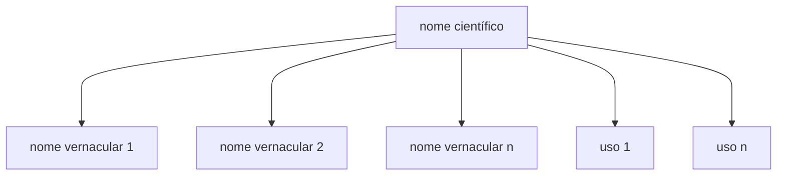
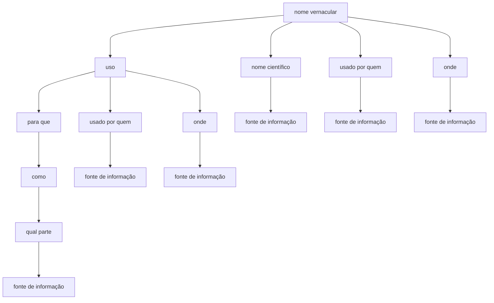

# Preservação do Conhecimento Tradicional Sobre o Uso das Plantas – pensando “fora da caixinha”

## 02 de junho de 2024

Há algum tempo tive a oportunidade – e o privilégio – de me envolver com {iniciativas, alunos, pesquisadores, conjuntos de dados} relacionados com o que é chamado de “conhecimento tradicional no uso das plantas”. Seja para confecção de artefatos, seja para o uso medicinal, tenho aprendido bastante com a Dra. Viviane Kruel, e suas alunas Nicky van Luijk, Luisa Ridolph Tostes Braga e Camila Nascimento Dantas. Uma experiência realmente enriquecedora e fascinante adentrar para um domínio tão complexo e desafiador, do ponto de vista da arquitetura de dados. Desta experiência, algumas percepções já se consolidaram, e outras, sob a forma de ideias, andam me assombrando nas noites frias de outono.

Antes de ir direto ao ponto, no aspecto de organização dos dados, preciso dizer que a ideia é polêmica (uma forma elegante de dizer que é “maluca”), e que arrisco perder os pouquíssimos amigos taxonomistas que tenho. Aliás, se você é taxonomista e tem um coração fraco, sugiro que pare de ler agora e volte para a Rodriguésia. Para quem continua por aqui, apertem seus cintos de segurança e vamos em frente!

Tradicionalmente (ironia à parte…), organizamos informação sobre as plantas de um ponto de vista que vou chamar agora de “acadêmico”, onde o nome científico é a “raiz”. O protagonista. O mais importante. O último biscoito do pacote. Qualquer atributo de uma espécie, por exemplo, seu nome vernacular e seu uso, são associados ao nome científico.

Nenhuma novidade ou polêmica até agora. Tudo calmo.

Agora, pense comigo: quando a um pesquisador vai em uma comunidade tradicional e escuta da Dona Maria, que do alto dos seus oitenta e tantos anos declara: “tem aquela plantinha de florzinha roxa que o chá é muito bom pra dor de cabeça“

Pronto. Quebrou o modelo.

Perceba que para qualquer, __absolutamente qualquer__, comunidade tradicional, o “tal” do nome científico é irrelevante! Não tem serventia alguma. Tentar preservar conhecimento tradicional usando uma estrutura “acadêmica”, centrada no nome científico, é abdicar de registrar a realidade do conhecimento tradicional. O modelo (p.ex. de um banco de dados) deve estar em consonância com o mundo real que ele quer modelar, e o nome científico simplesmente não pertence a este mundo real – o mundo do conhecimento tradicional. Tentar preservar conhecimento tradicional com o modelo acadêmico é, em minha opinião, como tentar estrangular alguém com um espaguete.

E agora? O conhecimento tradicional (lato sensu) PRECISA SER PRESERVADO, e com urgência, pois sua transmissão geracional está comprometida, por diversos fatores.

É aí que “pensamos fora da caixinha”, e estamos propondo um modelo alternativo, onde o nome vernacular é “o tal”!

É importante deixar claro que não estamos negando a importância da identificação taxonômica correta de espécies utilizadas por comunidades tradicionais. Essa ponte entre o conhecimento tradicional e acadêmico deve existir, por diversas razões. E o modelo não impede que, eventualmente, no futuro, esta relação entre o nome vernacular (que pode ser “a plantinha de flor roxa” da Dona Maria!) seja associado a um nome científico.

Entretanto, é claro para mim que o modelo centralizado no nome científico não atende a realidade de como o conhecimento tradicional é mantido, transmitido e valorizado nas diferentes comunidades e povos.

Para colocar em escala, publicações recentes indicam que somente para povos indígenas, existem 896 mil indígenas no Brasil, distribuídos em 900 terras indígenas reconhecidas oficialmente. Esses indígenas são divididos em 304 etnias ou povos indígenas diferentes. Essas etnias falam cerca de 274 línguas indígenas, o que representa cerca de 12% das línguas faladas no mundo. Algumas dessas etnias têm apenas algumas famílias, enquanto outras têm populações consideráveis.

Um “problema” com esta escala precisa de soluções urgentes, mas também inovadoras. Esta proposta ainda não está consolidada, e precisamos agregar cabeças para criticar e ajudar a pensar. São todos muito bem vindos! Deixe sua {contribuição, crítica, opinião etc.} aqui embaixo, ou entre em contato conosco!